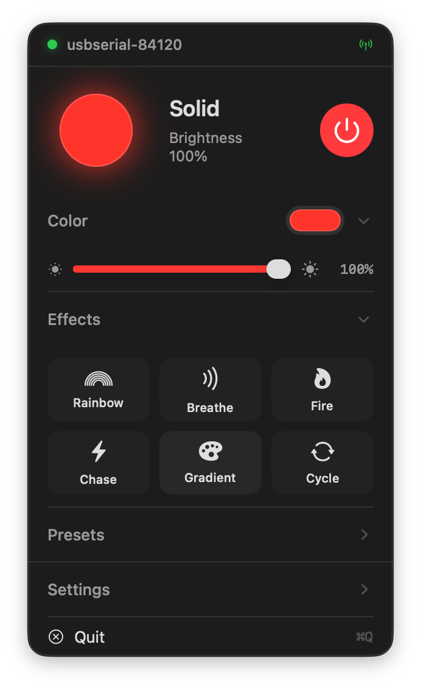
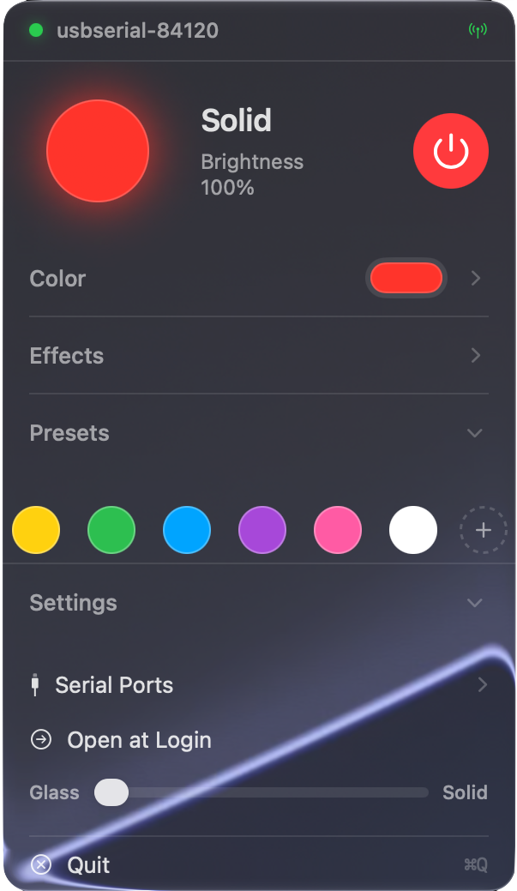
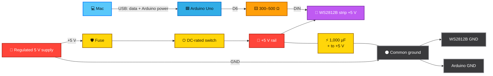

<div align="center">

# LED Control

**A native macOS menu-bar controller for WS2812B lighting.**

Control color, brightness, presets, and animated effects from a compact Liquid Glass panel while
an Arduino handles timing-critical LED rendering over a versioned USB serial protocol.

[](https://github.com/burakoskay/LedControl/releases/tag/v0.2.0-dev.1)
[](#building-from-source)
[](#building-from-source)
[](LICENSE)

</div>

<br>

<div align="center">
  
</div>

<br>

> [!IMPORTANT]
> This is a **Development Preview**. The DMG is signed with an Apple Development certificate,
> but it is not notarized. macOS will warn on first launch; see [Installing](#installing).
> LED Control has no accounts, analytics, subscriptions, or network dependency.

## What it does

**Controls the strip without getting in the way.** Pick an exact color, adjust brightness, save
custom presets, or switch the entire installation off from the menu bar.

**Runs six effects on the Arduino.** Rainbow, Breathe, Fire, Chase, Gradient, and Cycle render on
the microcontroller rather than streaming every pixel from macOS. Animation remains consistent
while the Mac is busy, and the speed control spans 0.25× to 4×.

**Reconnects to the right device.** Opening an Arduino serial port resets many boards. LED Control
retries its handshake during that reset window and enables controls only after the firmware replies
with the expected `LEDCTRL,1` protocol identifier.

**Remembers the useful things.** Color, brightness, speed, presets, appearance, and the last serial
port are stored locally. The app automatically reconnects when that port is available again.

**Feels at home on modern macOS.** The panel uses native Liquid Glass on macOS 26 and newer, falls
back to a system visual-effect material on older supported releases, and includes a Glass-to-Solid
appearance control.

<div align="center">
  
  <br>
  <sub>Collapsible controls, editable presets, serial-port selection, and adjustable Liquid Glass.</sub>
</div>

## Installing

1. Download the DMG from the [v0.2.0 Development Preview](https://github.com/burakoskay/LedControl/releases/tag/v0.2.0-dev.1).
2. Drag `LED Control.app` to `/Applications`.
3. **First launch may be blocked.** Right-click the app → **Open** → **Open**, or allow it under
   **System Settings → Privacy & Security**. This is expected for the non-notarized preview.
4. Upload the included firmware by following [Firmware setup](#firmware-setup).
5. Open the lightbulb in the menu bar, expand **Settings → Serial Ports**, and select the Arduino.

The green connection indicator means the serial port is open **and** the versioned firmware
handshake succeeded. Merely seeing a port name is not treated as a valid controller.

## Hardware

The included configuration is designed for:

- Arduino Uno or a compatible 5 V AVR board
- WS2812B 5 V addressable LED strip
- regulated 5 V supply sized for the strip
- 300–500 Ω data-line resistor
- fuse and DC-rated physical power switch
- 1,000 µF electrolytic capacitor rated for at least 6.3 V
- USB cable between the Mac and Arduino

The default firmware drives **128 pixels from pin D6**, uses **RGB** color order, and asks FastLED
to limit estimated strip current to **3,000 mA**.

## Wiring



| From | To | Purpose |
|---|---|---|
| Supply `+5 V` | Fuse → switch → strip `+5 V` | Powers the LEDs through protected, switched DC |
| Supply `GND` | Strip `GND` | Returns LED current to the supply |
| Supply `GND` | Arduino `GND` | Creates the common reference required by the data signal |
| Arduino `D6` | 300–500 Ω resistor → first pixel `DIN` | Carries the WS2812B data stream |
| 1,000 µF capacitor `+` | Strip `+5 V` input | Absorbs startup and animation transients |
| 1,000 µF capacitor `−` | Strip `GND` input | Completes the local input decoupling path |
| Mac USB | Arduino USB | Carries the 9,600-baud control protocol and powers the Uno logic |

> [!CAUTION]
> **Do not power the strip from the Arduino 5 V pin.** A 128-pixel strip can approach 7.7 A at
> unrestricted full white. Use a separate regulated supply, wire and fuse appropriate for the
> installation, and inject power at additional points when voltage drop becomes visible.

The physical switch belongs in the fused positive lead and must be rated for the DC voltage and
current it will interrupt. An intermittent or underrated switch can make the strip disappear while
the Arduino and app remain connected; software cannot repair a broken power path. Disconnect mains
and low-voltage power before rewiring. If you are not comfortable sizing conductors, fuses, and
enclosures, have the power side assembled by a qualified person.

For a 3.3 V microcontroller, add a 5 V logic-level shifter such as a 74AHCT125 between the GPIO and
the resistor. The Arduino Uno already produces 5 V logic and does not need that extra stage.

## Firmware setup

Install the Arduino AVR core and FastLED 3.10.3, then compile and upload:

```bash
arduino-cli core update-index
arduino-cli core install arduino:avr@1.8.7
arduino-cli lib install FastLED@3.10.3
arduino-cli compile --fqbn arduino:avr:uno Firmware/LEDController
arduino-cli upload --fqbn arduino:avr:uno \
  --port /dev/cu.usbmodemXXXX Firmware/LEDController
```

Find the correct port with `arduino-cli board list` and replace the example path before uploading.
The firmware source is [`Firmware/LEDController/LEDController.ino`](Firmware/LEDController/LEDController.ino).

Change these constants before uploading if your hardware differs:

| Constant | Default | Meaning |
|---|---:|---|
| `NUM_LEDS` | `128` | Number of addressable pixels |
| `DATA_PIN` | `6` | Arduino GPIO connected to the first pixel |
| `LED_TYPE` | `WS2812B` | FastLED chipset definition |
| `COLOR_ORDER` | `RGB` | Byte order expected by this strip; many strips use `GRB` |
| `MAX_POWER_MA` | `3000` | FastLED's estimated current ceiling—not a substitute for a fuse |

## Architecture

```mermaid
flowchart LR
    UI["🪟 SwiftUI menu-bar panel"]:::ui --> State["🎛️ LEDManager"]:::state
    State --> Codec["🧾 Bounded ASCII commands"]:::protocol
    Codec --> Serial["🔌 ORSSerialPort · 9,600 baud"]:::serial
    Serial --> Handshake["🤝 LEDCTRL,1 handshake"]:::protocol
    Handshake --> Firmware["🟦 Arduino firmware"]:::firmware
    Firmware --> FastLED["🌈 FastLED renderer"]:::led
    FastLED --> Strip["128 × WS2812B pixels"]:::led

    classDef ui fill:#bf5af2,stroke:#7d2da8,color:#ffffff,stroke-width:2px;
    classDef state fill:#5ac8fa,stroke:#007aff,color:#07131a,stroke-width:2px;
    classDef protocol fill:#ffd60a,stroke:#a06b00,color:#241a00,stroke-width:2px;
    classDef serial fill:#ff9f0a,stroke:#b35c00,color:#241500,stroke-width:2px;
    classDef firmware fill:#32ade6,stroke:#0066cc,color:#07131a,stroke-width:2px;
    classDef led fill:#ff375f,stroke:#a51f3d,color:#ffffff,stroke-width:2px;
```



The Mac sends compact state changes rather than pixel frames. Color, brightness, and speed updates
are throttled to 10 commands per second, comfortably below the serial link's capacity. Animated
effects execute inside the firmware's 20 ms render loop.

| Path | Responsibility |
|---|---|
| `LedControl` | SwiftUI interface, panel hosting, persistence, and serial coordination |
| `Firmware/LEDController` | Handshake, command validation, power limit, and LED rendering |
| `ORSSerialPort` | Vendored macOS serial transport and licence |
| `LedControlTests` | Protocol encoding and bounds regression tests |
| `Tools` | App, firmware, signing, and DMG verification |

## Serial protocol

Commands are newline-terminated ASCII at **9,600 baud**. Numeric inputs are range-checked by the
firmware; malformed values return `ERR,INVALID_COMMAND` instead of changing state.

| Command | Meaning |
|---|---|
| `HELLO` | Requests the versioned `LEDCTRL,1` identity response |
| `OFF` | Clears the strip and sets brightness to zero |
| `RAINBOW`, `BREATHING`, `FIRE`, `CHASE`, `GRADIENT`, `COLORCYCLE` | Selects an effect |
| `SPEED,0..100` | Sets the perceptual effect-speed curve |
| `BRIGHTNESS,0..100` | Changes brightness without replacing the current effect |
| `COLOR,R,G,B` | Stores an RGB color without changing mode |
| `B,R,G,B` | Selects solid color with brightness percentage and RGB bytes |

Serial is local transport, not an authentication or encryption boundary. The handshake prevents the
app from silently controlling an unrelated device; it is not intended to defend against a malicious
USB device with access to the Mac.

## Building from source

The app runs on macOS 13.0 or newer. Building the native Liquid Glass path requires Xcode 26 or
newer; the current development workflow uses `/Applications/Xcode-beta.app`.

```bash
git clone https://github.com/burakoskay/LedControl.git
cd LedControl
export DEVELOPER_DIR=/Applications/Xcode-beta.app/Contents/Developer
Tools/verify.sh
```

`Tools/verify.sh` runs strict SwiftLint, builds the Release app, executes the protocol tests, and
compiles the Arduino firmware when `arduino-cli` is installed.

To create the signed arm64 Development Preview DMG:

```bash
Tools/build-development-preview.sh
```

The packaging script verifies the app's exact bundle identifier, signing team, version, disk image,
and SHA-256 checksum before reporting success.

## Scope and limitations

- **Not notarized.** The current preview is Apple Development signed, not a public Developer ID build.
- **Apple silicon preview.** The packaged DMG currently contains an arm64 application.
- **USB serial only.** Bluetooth, Wi-Fi, HomeKit, and remote control are outside the current scope.
- **One configured strip.** Pixel count, pin, color order, and power ceiling are firmware constants.
- **No firmware flasher in the app.** Upload firmware with Arduino IDE or `arduino-cli`.
- **FastLED power limiting is an estimate.** It does not replace correct supply sizing, fusing,
  conductor sizing, power injection, or a reliable DC-rated switch.
- **Older macOS uses a fallback material.** Native Liquid Glass requires macOS 26 or newer.

## Security

Security and hardware-safety reports: **[SECURITY.md](SECURITY.md)**.

LED Control makes no network requests and collects no telemetry. Saved preferences stay in the
current user's standard macOS preferences domain. The serial parser has a fixed 32-byte command
buffer and rejects out-of-range numeric input.

## License

Copyright © 2026 Burak Oskay.

LED Control is open source under the **[MIT License](LICENSE)**. The vendored ORSSerialPort licence
and FastLED dependency notice are documented in **[THIRD_PARTY_NOTICES.md](THIRD_PARTY_NOTICES.md)**.
